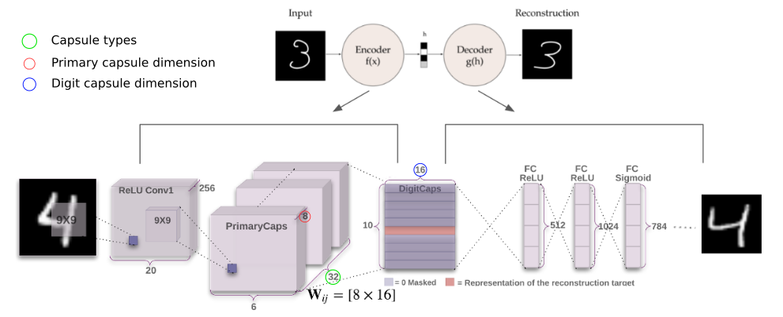

# **Capsule Networks tutorial with PyTorch**

**Author**: Riccardo Renzulli, PhD student, Computer Science Department, University of Turin, Italy

**Email**: riccardo.renzulli@unito.it



Reference paper: [Dynamic Routing Between Capsules](https://arxiv.org/pdf/1710.09829.pdf)

A **capsule** is a subset of neurons in a layer.

Each capsule represents the presence and the instantiation parameters of an **entity**.

A capsule consists of two association parameters:

1.   the **probability** that an object of that type is present
2.   the generalized **pose** (position, orientation, scale, deformation, velocity, color etc.).

Image source: https://cezannec.github.io/assets/capsules/capsule_output.gif


<center>

</center>
<br/>

The **routing algorithm** is performed between PrimaryCaps and DigitCaps layers.

<center>

</center>
<br/>

Image source: https://cezannec.github.io/assets/capsules/dynamic_routing.gif

# Running MNIST tutorial on Google Colab

https://colab.research.google.com/drive/1Ezsjvie56sIk8II9-lNyjgmKC_lgbMC9#scrollTo=vEUDVULH7mLu

# Or Running locally

## Prerequisites

```
pip install virtualenv
virtualenv mypython
source mypython/bin/activate
pip install -r requirements.txt
cd src/
```

## Training on MNIST

```
python main.py --config configs/mnist.json
```

More arguments can be found in **configs/mnist.json**

## Other datasets

Training on Fashion-MNIST and CIFAR10 is also supported.

```
python main.py --config configs/fashionmnist.json
python main.py --config configs/cifar10.json
```

## Visualizing results

```
python visualization.py --config <path-to-config-used-for-training> --checkpoint <path-to-checkpoint.pt>
```

